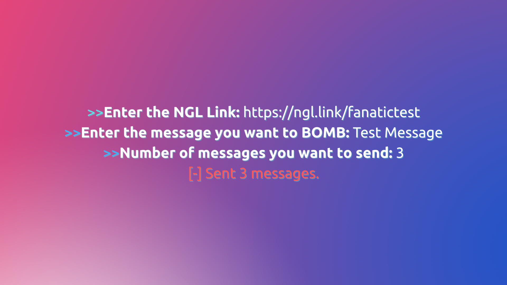

# 💣NGL-Bomber
A simple automation tool for bombing anyone's anonymous NGL handle.
### ☑️You need Linux to use this tool  

## 🤓What is NGL?
It is a simple web application that allows users to get messages without knowing who is sending them. NGL provides us with a link which, when visited, opens up a messaging window to write your message and send it.

## 😄My purpose of making NGL-Bomber
When going through the stories on Instagram, I noticed that many people, including many of my friends, were posting their NGL links on their stories. I opened and looked at them and found that we can anonymously send messages without them knowing. Suddenly, an idea struck my mind: why not bomb his inbox with the same messages and prank him?
  
**I suggest you to use it only for fun and in limit as this tool is not made to harm anyone by any means.**

## 🔽Installation
1. Clone the repository
```
git clone https://github.com/rishabhyadavm07/NGL-Bomber.git
```
*You must have Git installed in order to run the above command.*

2. Change the directory and get into the clonned directory
```
cd NGL-Bomber
```

3. Install the requirements using pip
```
pip install -r requirements.txt
```
4. Give the bash file execute permissions
```
chmod +x Setup.sh
```
5. Execute the bash Setup.sh file
```
./Setup.sh
```
6. Run the NglBomber.py file and ENJOY !
```
python NglBomber.py
```
- This program will be taking 3 inputs :   
    1. NGL Link  
        *Eg: `https://ngl.link/fanatictest`*  
    2. Message  
    3. Number of messages you want to sent to the victim.  



## 📖Read
**This program automatically downloads a chrome driver and uses it to access the NGL link and send the messages automatically, then closes it. The chrome panel is configured to open to its tiniest size.**
